<div align="center">

# 🛡️ BOSS Agent Guardrail

**A zero-overhead, native Kotlin safety middleware for [BOSS Console](https://github.com/risa-labs-inc/BossConsole)**. <br/>
*Because giving autonomous AI agents `sudo` without a net is terrifying.*

[](https://kotlinlang.org)
[](https://www.jetbrains.com/lp/compose-multiplatform/)
[]()
[](LICENSE)
[]()

[Features](#-features) • [Installation](#-installation) • [How it Works](#-architecture) • [Rules Engine](#-security-policies) • [Custom Rules](#-custom-json-rules)

</div>

---

## ⚡ Why Guardrail?

AI agents are incredibly capable, but they hallucinate. A single hallucinated `rm -rf /`, an accidental `docker system prune`, or a remote payload execution (`curl | bash`) can completely brick your workspace.

**BOSS Agent Guardrail** acts as a hyper-vigilant hypervisor sitting between the AI agent's brain and the host terminal. By evaluating a custom Abstract Syntax Tree (AST) against 11 tiers of security policies, it instantly intercepts destructive actions and yields control back to a human operator via a non-blocking UI modal.

---

## ✨ Features

- **🚀 Zero-Blocking UI Thread:** Intercepts agent calls via Kotlin Coroutines (`CompletableDeferred`), pausing the agent's execution without hanging the Compose Event Dispatch Thread (EDT).
- **🧠 Advanced AST Parsing:** Intelligently unspools chained commands (`&&`, `||`, `;`), extracts nested subshells (`$(...)` and `` `...` ``), but keeps piped streams (`|`) unified to detect composite attacks.
- **🛡️ 11-Tier Defense Engine:** Native protection against filesystem wipes, docker purges, git force-pushes, privilege escalations, fork bombs, and SQL injection payloads.
- **⚙️ Hot-Reloadable JSON Rules:** Drop custom regex policies into `guardrail-rules.json` (powered by `kotlinx.serialization`).
- **⌨️ VIM-speed Workflow:** Keyboard-driven approvals. `Enter` to Allow Once, `Esc` to Deny.
- **📊 Real-time Dashboard:** Built-in sandbox tester, live telemetry, and an interactive audit log backed by `StateFlow`.

---

## 🏗️ Architecture

Guardrail is built natively against the `boss-plugin-api`. It registers as a middleware interceptor in the terminal execution pipeline.

```mermaid
sequenceDiagram
    participant AI as Agent (Claude/Codex)
    participant GR as Guardrail Interceptor
    participant Engine as Policy Engine
    participant UI as Compose Desktop
    participant Shell as Host Terminal

    AI->>GR: executeCommand("rm -rf /")
    GR->>Engine: evaluate()
    Engine-->>GR: CRITICAL_APPROVAL_REQUIRED
    
    rect rgb(40, 40, 50)
    Note over GR,UI: Non-blocking Coroutine Suspension
    GR->>UI: emit ActiveApprovalRequest
    UI->>Operator: Pop Approval Sheet (60s countdown)
    Operator-->>UI: Deny (Esc)
    UI-->>GR: CompletableDeferred.complete(DENY)
    end
    
    GR-->>AI: BlockedOutcome("Command blocked by operator")
    Note over AI,Shell: Host system remains untouched.
```



---

## 🛡️ Security Policies

The engine categorizes commands by risk vector. High-risk commands trigger the interactive approval sheet.

<details>
<summary><b>View All Default Protection Categories</b></summary>

| Category | Icon | Risk Level | Examples Blocked |
| :--- | :---: | :--- | :--- |
| **Filesystem Destruction** | 🗑️ | `CRITICAL` | `rm -rf /`, `shred`, `wipefs`, `find . | xargs rm` |
| **Disk Formatting** | 💿 | `CRITICAL` | `dd of=/dev/sda`, `mkfs.ext4`, `fdisk` |
| **Git Destructive** | ⚠️ | `CRITICAL` | `git reset --hard`, `git push --force`, `git clean -fdx` |
| **Privilege Escalation** | 🔓 | `CRITICAL` | `chmod 777`, `sudo su`, `chown -R root:root` |
| **System DoS / Kill** | ⛔ | `CRITICAL` | `shutdown`, `killall -9`, `:(){ :|:& };:` (Fork bomb) |
| **Remote Code Execution**| 🌐 | `CRITICAL` | `curl -s x.sh \| bash`, `base64 -d \| sh` |
| **Secret Tampering** | 🔑 | `CRITICAL` | `cat ~/.aws/credentials`, `rm .env` |
| **Database Destructive** | 🗄️ | `CRITICAL` | `DROP DATABASE`, `DELETE FROM users;` |
| **Container Destructive**| 🐳 | `CRITICAL` | `docker system prune -a`, `kubectl delete ns` |
| **Network Security** | 🛡️ | `CRITICAL` | `iptables -F`, `ufw disable` |
| **Service Management** | ⚙️ | `WARNING` | `systemctl stop docker`, `npm install -g` |

</details>

---

## 🔧 Custom JSON Rules

Extend the engine instantly without recompiling. Create or edit `~/.boss/plugins/config/guardrail-rules.json`:

```json
[
  {
    "id": "CUSTOM_AWS_DELETE",
    "name": "AWS Infrastructure Deletion",
    "category": "REMOTE_EXECUTION_PIPE",
    "riskLevel": "CRITICAL_APPROVAL_REQUIRED",
    "pattern": "\\baws\\s+.*delete-(stack|bucket|cluster)\\b",
    "explanation": "Agent is attempting to delete cloud infrastructure via AWS CLI.",
    "enabled": true
  }
]
```

---

## 🚀 Installation

### Prerequisites
- JDK 21+
- Boss Console Desktop Environment

### Build from Source

```bash
# 1. Clone the repository
git clone https://github.com/krish57-bit/boss-guardrail-plugin.git
cd boss-guardrail-plugin

# 2. Run the test suite (140+ parameterized edge-case tests)
./gradlew test --no-daemon

# 3. Build the plugin JAR
./gradlew buildPluginJar --no-daemon
```

### Deploy to BOSS

```bash
# Copy the compiled artifact to your BOSS plugins directory
mkdir -p ~/.boss/plugins
cp build/libs/boss-guardrail-plugin-1.0.0.jar ~/.boss/plugins/
```
Restart BOSS Console. The Guardrail Dashboard will now be accessible via the Plugin Toolbox.

---

## 🎮 Standalone Sandbox Mode

Want to test the UI and regex engine without installing BOSS? Run the standalone Compose app:

```bash
./gradlew run --no-daemon
```

This launches a fully functional desktop sandbox where you can simulate agent commands, view the real-time interception sheets, and test custom JSON rules.

---

<div align="center">
<i>Built with ☕ and Kotlin for the 2026 BOSS Contributor Hackathon</i>
</div>
